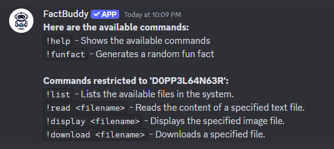
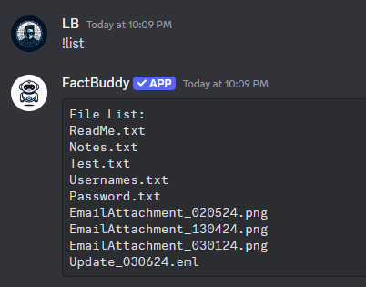
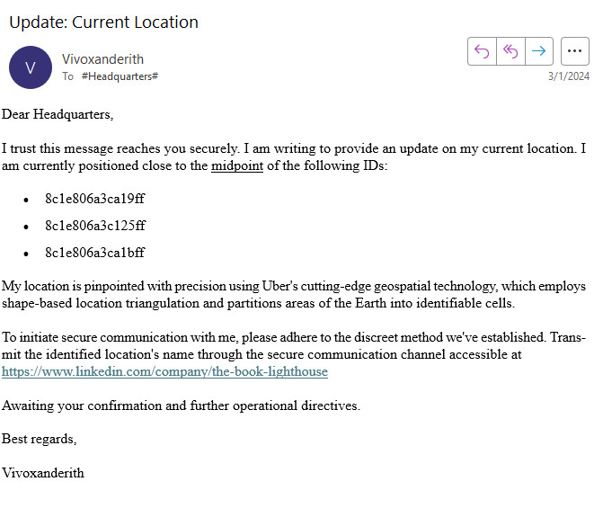
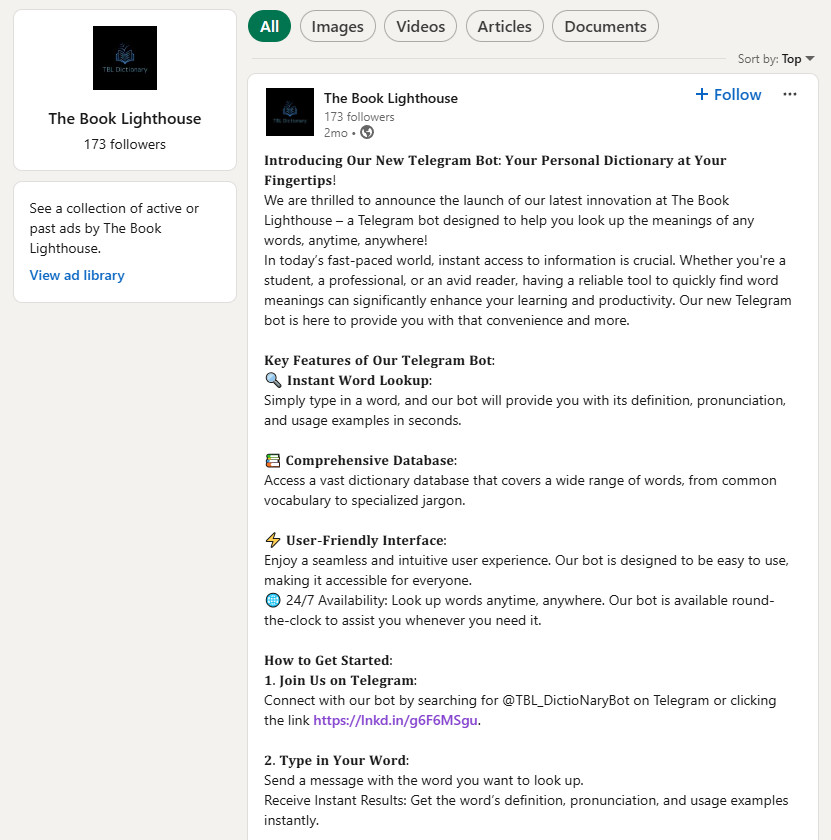
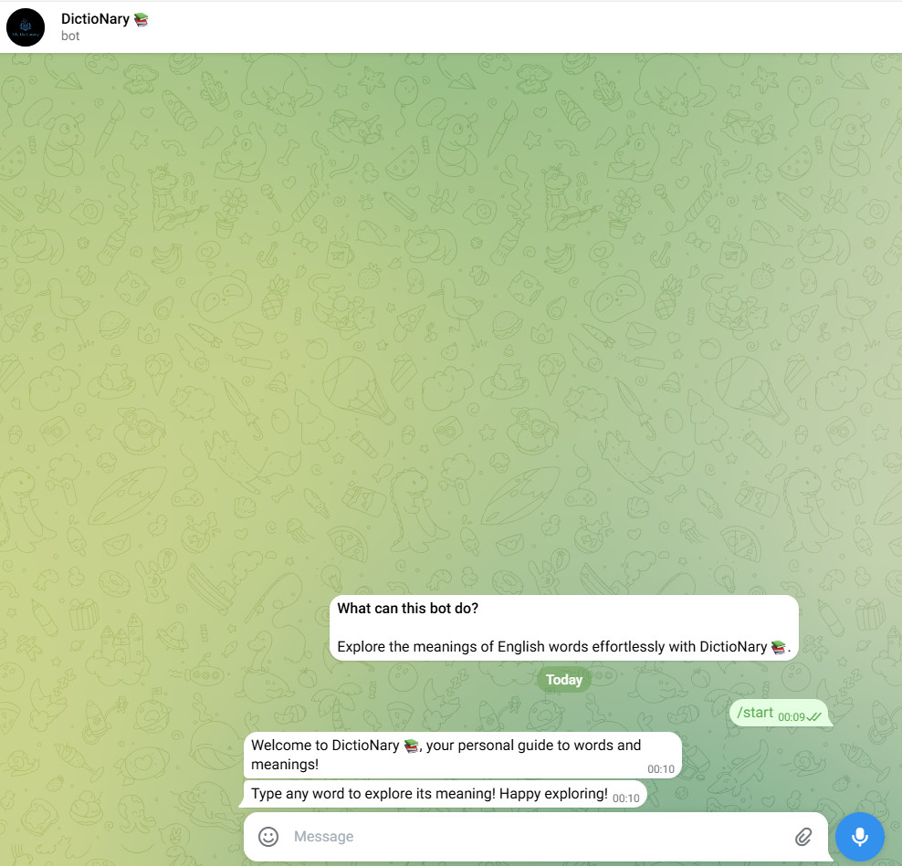
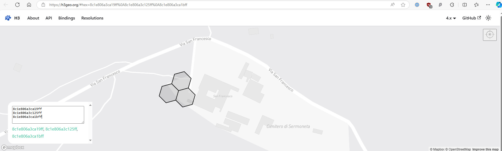
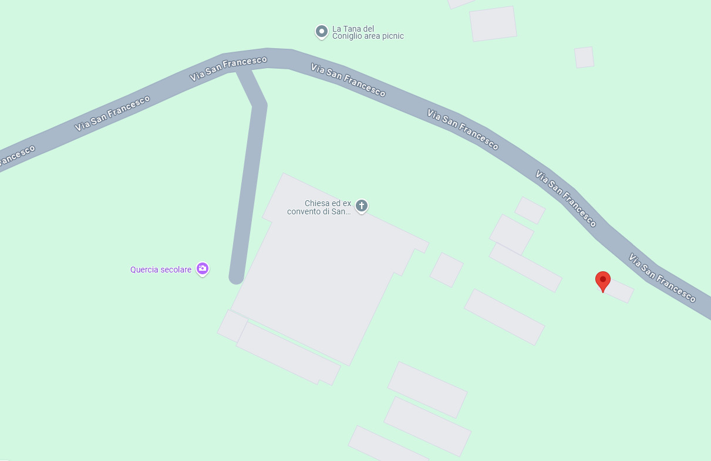
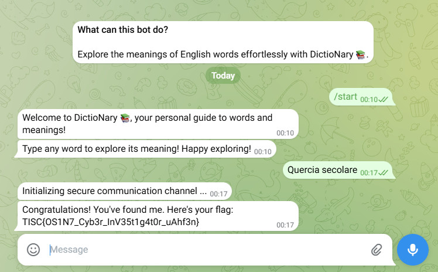

# Level 1: Navigating the Digital Labyrinth

## Description
>The dust has settled since we won the epic battle against PALINDROME one year ago.
>
>Peace returned to cyberspace, but it was short-lived. Two months ago, screens turned deathly blue, and the base went dark. When power returned, a mysterious entity glitched to life on our monitors. No one knows where it came from or what it plans to do.
>
>Amidst the clandestine realm of cyber warfare, intelligence sources have uncovered the presence of a formidable adversary, Vivoxanderith—a digital specter whose footprint spans the darkest corners of the internet. As a skilled cyber operative, you are entrusted with the critical mission of investigating this elusive figure and their network to end their reign of disruption.
>
>Recent breakthroughs have unveiled Vivoxanderith's online persona: **vi_vox223**. This revelation marks a pivotal advancement in our pursuit, offering a significant lead towards identifying and neutralizing this threat.
>
>Our mission now requires a meticulous investigation into **vi_vox223**'s activities and connections within the cyber underworld. Identifying and tracking Vivoxanderith brings us one crucial step closer to uncovering the source of the attack and restoring stability to our systems. It is up to you, agent!

## Solution
Search `vi_vox223` using sherlock.

```bash
┌──(kali㉿kali)-[~/Desktop]
└─$ sherlock vi_vox223
[*] Checking username vi_vox223 on:

[+] Dealabs: https://www.dealabs.com/profile/vi_vox223
[+] Fiverr: https://www.fiverr.com/vi_vox223
[+] HackTheBox: https://forum.hackthebox.eu/profile/vi_vox223
[+] HackenProof (Hackers): https://hackenproof.com/hackers/vi_vox223
[+] HudsonRock: https://cavalier.hudsonrock.com/api/json/v2/osint-tools/search-by-username?username=vi_vox223
[+] Instagram: https://instagram.com/vi_vox223
[+] Kick: https://kick.com/vi_vox223
[+] LibraryThing: https://www.librarything.com/profile/vi_vox223
[+] Lichess: https://lichess.org/@/vi_vox223
[+] PepperIT: https://www.pepper.it/profile/vi_vox223/overview
[+] ProductHunt: https://www.producthunt.com/@vi_vox223
[+] Vero: https://vero.co/vi_vox223

[*] Search completed with 12 results
```

Found interesting Instagram page.

  

Found Discord Bot ID `1284162498966192270` and reference to needing `D0PP3L64N63R` role to access hidden features when browsing account's Instagram Story.

Added Discord Bot to a test server using the url https://discord.com/oauth2/authorize?client_id=1284162498966192270&scope=bot&permissions=8.

Added `D0PP3L64N63R` role to myself and new commands appear.

  

List available files in the system.

  

Downloaded `Update_030624.eml`.

  

Visited https://www.linkedin.com/company/the-book-lighthouse and found reference to @TBL_DictioNaryBot on Telegram.

  

Clicked on https://lnkd.in/g6F6MSgu.

  

Searched for `8c1e806a3ca19ff`, `8c1e806a3c125ff` and `8c1e806a3ca1bff` on https://h3geo.org/.

  

Match the location at the midpoint using Google Maps.

  

Type `Quercia secolare` into Telegram Bot DictioNary.

  

## Flag
`TISC{OS1N7_Cyb3r_InV35t1g4t0r_uAhf3n}`