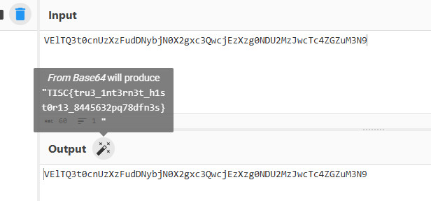

# Level 3: Digging Up History

## Description
>Ah, who exactly is behind the attacks? If only our enemies left more images on their image transformation server. We are one step closer, but there is still so much to uncover...
>
>A disc image file was recovered from them! We have heard that they have a history of hiding sensitive data through file hosting sites... Can you help us determine what they might be hiding this time?
>
>https://assets-hgsv2z3wsyxzjayx.sgp1.digitaloceanspaces.com/disk.zip
>
>Attached files:
>metadata.txt

## Solution
Add Evidence Item `csitfanUPDATED0509.ad1` into FTK Imager and exported all files.

  

Run KAPE Module `!EZParser` on exported files.

  

In `FileFolderAccess` folder, when examining `20240914140332_LECmd_Output.csv` in Timeline Explorer, observed the following strings related to flag.

  

Search for strings related to `flag.txt` and `flag.sus` in all exported files.

```bash
sanforensics@DESKTOP-A9EKR5D:/mnt/c/Users/DF333/Desktop/Image/Export$ grep -ri "flag.txt" .
Binary file ./Documents and Settings/csitfan1/NTUSER.DAT matches
Binary file ./Documents and Settings/csitfan1/NTUSER.DAT.LOG.FileSlack matches
Binary file ./Documents and Settings/csitfan1/Recent/flag.txt (2).lnk matches
Binary file ./Documents and Settings/csitfan1/Recent/flag.txt.lnk matches
Binary file ./RECYCLER/S-1-5-21-2025429265-1035525444-725345543-1003/INFO2.FileSlack matches
Binary file ./System Volume Information/_restore{A519EE23-3D84-4FC8-9660-C7CE142C7593}/RP2/A0001013.lnk matches

sanforensics@DESKTOP-A9EKR5D:/mnt/c/Users/DF333/Desktop/Image/Export$ grep -ri "flag.sus" .
Binary file ./$LogFile matches
Binary file ./Documents and Settings/csitfan1/Application Data/Mypal68/Profiles/a80ofn6a.default-default/places.sqlite matches
Binary file ./Documents and Settings/csitfan1/Local Settings/Application Data/Mypal68/Profiles/a80ofn6a.default-default/cache2/entries/8EA5B9296FDF7C32DAA8DD848E74AD83F49B2815 matches
Binary file ./Documents and Settings/csitfan1/NTUSER.DAT matches
Binary file ./Documents and Settings/csitfan1/NTUSER.DAT.LOG.FileSlack matches
Binary file ./Documents and Settings/csitfan1/Recent/flag.lnk matches
Binary file ./pagefile.sys matches
```

When examining `$LogFile` in HxD Hex Editor, found url https://csitfan-chall.s3.amazonaws.com/flag.sus.

  

Downloaded `flag.sus` from the url and examined the file in HxD Hex Editor.

  

Using CyberChef `Magic` operation, detected that data is Base64 encoded.

  

Applied `From Base64` recipe using CyberChef.

  

## Flag
`TISC{tru3_1nt3rn3t_h1st0r13_8445632pq78dfn3s}`