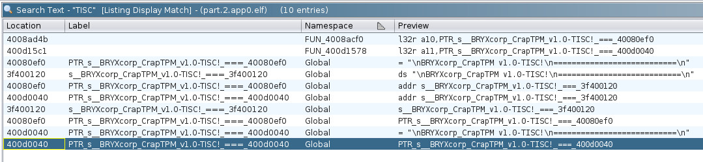

# Level 5: Hardware isnt that Hard!

## Description
>Shucks... it seems like our enemies are making their own silicon chips??!? They have decided to make their own source of trust, a TPM (Trusted Platform Module) or I guess their best attempt at it.
>
>Your fellow agent smuggled one out for us to reverse engineer. Don't ask us how we did it, we just did it, it was hard ...
>
>All we know so far is that their TPM connects to other devices using the i2c bus and does some security stuff inside. Agent! Your mission, should you choose to accept it, is to get us unparalleled intel by finding their TPM's weakness and exfiltrating its secrets.
>
>You will be provided with the following compressed flash dump:
>  - MD5 (flash_dump.bin.xz) = fdff2dbda38f694111ad744061ca2f8a
>
>Flash was dumped from the device using the command:
>esptool.py -p /dev/REDACTED -b 921600 read_flash 0 0x400000 flash_dump.bin
>
>You can perform your attack on a live TPM module via the i2c implant device hosted behind enemy lines: nc chals.tisc24.ctf.sg 61622
>
>Attached files:
>flash_dump.bin.xz

## Solution
Prepare the files.

```bash
┌──(kali㉿kali)-[~/Desktop/level-5]
└─$ md5sum flash_dump.bin.xz                
fdff2dbda38f694111ad744061ca2f8a  flash_dump.bin.xz

┌──(kali㉿kali)-[~/Desktop/level-5]
└─$ unxz flash_dump.bin.xz
```

Checked for interesting strings.

```bash

┌──(kali㉿kali)-[~/Desktop/level-5]
└─$ strings flash_dump.bin | grep -i 'tisc'                                                                
BRYXcorp_CrapTPM v1.0-TISC!
2yTISC{FALSE_FLAG}BRYXcorp_CrapTPM
```

Used [esp32knife](https://github.com/BlackVS/esp32knife) to operate on `flash_dump.bin`.

```bash
┌──(kali㉿kali)-[~/Desktop/level-5/esp32knife]
└─$ python3 esp32knife.py --chip=esp32 load_from_file ../flash_dump.bin
Prepare output directories:
- creating directory: parsed
Reading firmware from: ../flash_dump.bin
Warning: some reserved header fields have non-zero values. This image may be from a newer esptool.py?
Writing bootloader to: parsed/bootloader.bin
Bootloader image info:
=================================================================================
Warning: some reserved header fields have non-zero values. This image may be from a newer esptool.py?
Image version: 1
Entry point: 400805f0
real partition size: 18992
secure_pad: None
flash_mode: 2
flash_size_freq: 47
3 segments

Segment 1 : len 0x00540 load 0x3fff0030 file_offs 0x00000018 include_in_checksum=True BYTE_ACCESSIBLE,DRAM,DIRAM_DRAM
Segment 2 : len 0x0368c load 0x40078000 file_offs 0x00000560 include_in_checksum=True CACHE_APP
Segment 3 : len 0x00e10 load 0x40080400 file_offs 0x00003bf4 include_in_checksum=True IRAM
Checksum: f9 (valid)
Validation Hash: 92a2d60d63e987bbf4d53c262c9380526f73766f436d7673804a06132db94064 (valid)
Warning: some reserved header fields have non-zero values. This image may be from a newer esptool.py?
Segment at addr=0x3fff0030 => {'BYTE_ACCESSIBLE', 'DIRAM_DRAM', 'DRAM'} => .dram0.data
Segment at addr=0x40078000 => {'CACHE_APP'} => .iram_loader.text
Segment at addr=0x40080400 => {'IRAM'} => .iram0.text

Adding program headers
prg_seg 0 : 3fff0030 00000540 rw .dram0.data
prg_seg 1 : 40078000 0000368c rx .iram_loader.text
prg_seg 2 : 40080400 00000e10 rwx .iram0.text
Program Headers:
Type  Offset    VirtAddr  PhysAddr  FileSize  MemSize  Flg Align
 1    000001c1  3fff0030  3fff0030  00000540  00000540  6  1000
 1    00000701  40078000  40078000  0000368c  0000368c  5  1000
 1    00003d8d  40080400  40080400  00000e10  00000e10  7  1000

Writing ELF to parsed/bootloader.bin.elf...
=================================================================================

Partition table found at: 8000
Verifying partitions table...
Writing partitions table to: parsed/partitions.csv
Writing partitions table to: parsed/partitions.bin
PARTITIONS:
   0  nvs      DATA:nvs   off=0x00009000 sz=0x00005000  parsed/part.0.nvs
      Parsing NVS partition: parsed/part.0.nvs to parsed/part.0.nvs.cvs
      Parsing NVS partition: parsed/part.0.nvs to parsed/part.0.nvs.txt
      Parsing NVS partition: parsed/part.0.nvs to parsed/part.0.nvs.json
   1  otadata  DATA:ota   off=0x0000e000 sz=0x00002000  parsed/part.1.otadata
   2  app0     APP :ota_0 off=0x00010000 sz=0x00140000  parsed/part.2.app0
   3  app1     APP :ota_1 off=0x00150000 sz=0x00140000  parsed/part.3.app1
   4  spiffs   DATA:spiffs off=0x00290000 sz=0x00160000  parsed/part.4.spiffs
   5  coredump DATA:coredump off=0x003f0000 sz=0x00010000  parsed/part.5.coredump

APP PARTITIONS INFO:
=================================================================================
Partition  app0     APP :ota_0 off=0x00010000 sz=0x00140000 
-------------------------------------------------------------------
Warning: some reserved header fields have non-zero values. This image may be from a newer esptool.py?
Image version: 1
Entry point: 40082980
real partition size: 275040
secure_pad: None
flash_mode: 2
flash_size_freq: 47
5 segments

Segment 1 : len 0x0d258 load 0x3f400020 file_offs 0x00000018 include_in_checksum=True DROM
  DROM, app data: secure_version = 0000 app_version=esp-idf: v4.4.6 3572900934 project_name=arduino-lib-builder date=Oct  4 2023 time=16:50:20 sdk=v4.4.6-dirty
Segment 2 : len 0x02d98 load 0x3ffbdb60 file_offs 0x0000d278 include_in_checksum=True BYTE_ACCESSIBLE,DRAM
Segment 3 : len 0x23c74 load 0x400d0020 file_offs 0x00010018 include_in_checksum=True IROM
Segment 4 : len 0x01388 load 0x3ffc08f8 file_offs 0x00033c94 include_in_checksum=True BYTE_ACCESSIBLE,DRAM
Segment 5 : len 0x0e204 load 0x40080000 file_offs 0x00035024 include_in_checksum=True IRAM
Checksum: b1 (valid)
Validation Hash: 031e80349dc3bc1767451a0fe50b7502c7ae687e566908e8a6ef682e4da19172 (valid)
Warning: some reserved header fields have non-zero values. This image may be from a newer esptool.py?
Segment at addr=0x3f400020 => {'DROM'} => .flash.rodata
Segment at addr=0x3ffbdb60 => {'BYTE_ACCESSIBLE', 'DRAM'} => .dram0.data
Segment at addr=0x3ffc08f8 => {'BYTE_ACCESSIBLE', 'DRAM'} => .dram0.data
Join segments 0x3ffbdb60 and 0x3ffc08f8
Segment at addr=0x40080000 => {'IRAM'} => .iram0.vectors
Segment at addr=0x400d0020 => {'IROM'} => .flash.text

Adding program headers
prg_seg 0 : 3f400020 0000d258 rw .flash.rodata
prg_seg 1 : 3ffbdb60 00004120 rw .dram0.data
prg_seg 2 : 40080000 0000e204 rx .iram0.vectors
prg_seg 3 : 400d0020 00023c74 rx .flash.text
Program Headers:
Type  Offset    VirtAddr  PhysAddr  FileSize  MemSize  Flg Align
 1    00000214  3f400020  3f400020  0000d258  0000d258  6  1000
 1    0000d46c  3ffbdb60  3ffbdb60  00004120  00004120  6  1000
 1    0001158c  40080000  40080000  0000e204  0000e204  5  1000
 1    0001f790  400d0020  400d0020  00023c74  00023c74  5  1000

Writing ELF to parsed/part.2.app0.elf...
Partition  app1     APP :ota_1 off=0x00150000 sz=0x00140000 
-------------------------------------------------------------------
Failed to parse : parsed/part.3.app1
Invalid firmware image magic=0x0
=================================================================================
```

Checked `partitions.csv` in `parsed`. Examined the contents and found 2 ELF.

```
┌──(kali㉿kali)-[~/Desktop/level-5/esp32knife/parsed]
└─$ cat partitions.csv
# ESP-IDF Partition Table
# Name, Type, SubType, Offset, Size, Flags
nvs,data,nvs,0x9000,20K,
otadata,data,ota,0xe000,8K,
app0,app,ota_0,0x10000,1280K,
app1,app,ota_1,0x150000,1280K,
spiffs,data,spiffs,0x290000,1408K,
coredump,data,coredump,0x3f0000,64K,

┌──(kali㉿kali)-[~/Desktop/level-5/esp32knife/parsed]
└─$ find . -name "*.elf"                                                                                                                            
./part.2.app0.elf
./bootloader.bin.elf

┌──(kali㉿kali)-[~/Desktop/level-5/esp32knife/parsed]
└─$ strings bootloader.bin.elf | grep -i "tisc"

┌──(kali㉿kali)-[~/Desktop/level-5/esp32knife/parsed]
└─$ strings part.2.app0.elf | grep -i "tisc" 
BRYXcorp_CrapTPM v1.0-TISC!
2yTISC{FALSE_FLAG}BRYXcorp_CrapTPM
```

Analyse `part.2.app0.elf` using Ghidra.

  

Search Program Text.

  

Found interesting functions `FUN_4008acf0` and `FUN_400d1578`. Examined them further.

  

Decided to focus on examining `FUN_400d1578` due to presence of `TISC` related strings.

  

Summarising the findings.

```
FUN_400d1578:
Slave Address is 0x69.
Binary Representation is 01101001.
--------------------
FUN_400d1614:
0x46 is likely a command payload.

LAB_400d1689:
    if (uVar5 == 0x46) {
      iVar6 = 0;
      do {
        memw();
        bVar1 = (&DAT_3ffbdb6a)[iVar6];
        bVar4 = FUN_400d1508();
        memw();
        *(byte *)(iVar6 + 0x3ffc1c80) = bVar1 ^ bVar4;
        iVar6 = iVar6 + 1;
      } while (iVar6 != 0x10);
    }
--------------------
FUN_400d1508:
Function seem to performing some bit manipulation operations.

ushort FUN_400d1508(void)

{
  ushort uVar1;
  
  memw();
  memw();
  uVar1 = DAT_3ffbdb68 << 7 ^ DAT_3ffbdb68;
  memw();
  memw();
  memw();
  uVar1 = uVar1 >> 9 ^ uVar1;
  memw();
  memw();
  memw();
  DAT_3ffbdb68 = uVar1 << 8 ^ uVar1;
  memw();
  memw();
  return DAT_3ffbdb68;
}
```

Researched on I2C Protocol, then attempt to interact with the device at 0x69.

```
The first seven bits of the byte comprise the slave address. The eighth bit is the read/write flag where 0 indicates a write and 1 indicates a read. The I2C bus specification specifies that in standard-mode I2C, the slave address is 7-bits long followed by the read/write bit.
Reference: https://www.totalphase.com/support/articles/200349176-7-bit-8-bit-and-10-bit-i2c-slave-addressing/.

To write to 01101001, remove first bit and add 0 at end.
11010010
Cyberchef from binary to hex: d2

Command payload is 46.

To read from 01101001, remove first bit and add 1 at end.
11010011
Cyberchef from binary to hex: d3
```

Trial and error testing revealed that maximum RECV is `RECV 32`.

`SEND d2 46` and `SEND d3`, before `RECV 32`.

```
> SEND d2 46        
> SEND d3
> RECV 32
ba dd 92 07 09 09 ad dc 9c 5a 57 0a 7b c2 1e 39 00 00 00 00 00 00 00 00 00 00 00 00 00 00 00 00
> SEND d2 46
> SEND d3
> RECV 32
0d f7 ba 73 46 c9 72 c4 89 cd 6c ce 93 48 91 57 00 00 00 00 00 00 00 00 00 00 00 00 00 00 00 00
> SEND d2 46
> SEND d3
> RECV 32
6e 70 fb 84 41 3c 32 81 3a fd 0b 54 5f 87 c9 22 00 00 00 00 00 00 00 00 00 00 00 00 00 00 00 00
```

Based on tests, determined that return is 16 bytes only. `RECV 16` is enough. Additionally, observed that the 16 bytes returned is not the same each round.

Write python script using ChatGPT to interact with server. Summarising code flow:
1. **Connection Setup:**
   - The script starts by establishing a connection to the CTF challenge server at `chals.tisc24.ctf.sg` on port `61622`.
2. **Interaction with the Service:**
   - The `interact_with_service()` function sends specific commands to the server and captures a 16-byte response after a series of prompts.
3. **Pseudorandom Number Generation:**
   - The `prng_function()` function simulates a custom pseudorandom number generation mechanism based on bitwise shifts and XORs.
   - The `compute_prng_sequence()` function generates a sequence of pseudorandom numbers for a given seed.
4. **Main Logic:**
   - The `main()` function retrieves data from the server, processes it by XORing it with the PRNG output for a range of seed values, and checks for a valid flag. If a valid flag is found (with all printable ASCII characters), it prints the flag.
5. **Connection Cleanup:**
   - After the script completes, the remote connection is closed to free up resources.

Python script can be found [here](./level-5-solution.py).

```bash
┌──(kali㉿kali)-[~/Desktop/level-5]
└─$ python level-5-solution.py                                         
[+] Opening connection to chals.tisc24.ctf.sg on port 61622: Done
Captured response: 2b 9b f1 a8 56 de ec 7b a7 ee db 9b 1b fb ac b5
Flag obtained: TISC{hwfuninnit}
[*] Closed connection to chals.tisc24.ctf.sg port 61622
```

## Flag
`TISC{hwfuninnit}`